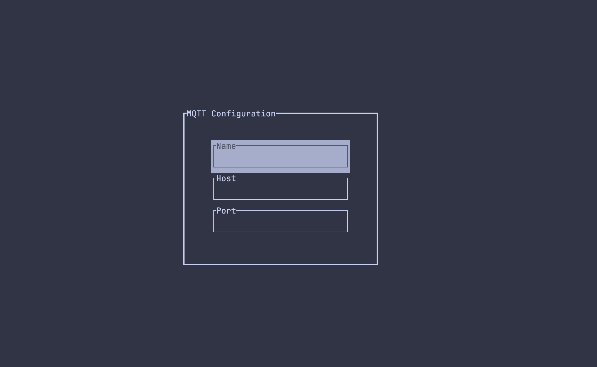
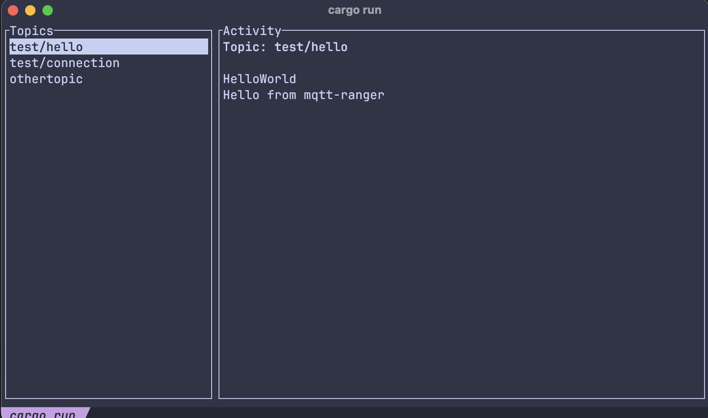

# mqtt-ranger
A minimal MQTT exploration tool implemented in Rust for personal use.





It shows MQTT topics and messages in real time in your terminal.

## Use

```bash
git clone https://github.com/develatter/mqtt-ranger
cd mqtt-ranger
cargo run
```

## License
See [License](LICENSE).

## Contributions
Feel free to submit your PR 😊.
